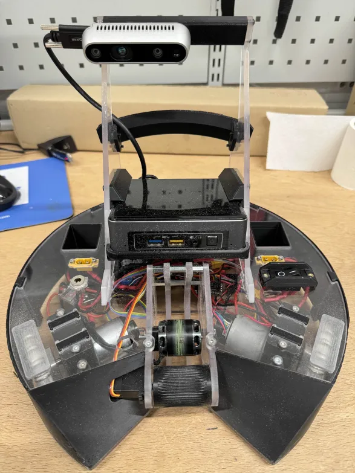

= 1.9 TDI Robot Project
:toc:
:sectnums:

== Project Overview
This repository contains the full system developed for the DeltaX Competition (Basketball Track) at the University of Tartu, including mechanics, electronics, firmware, and ROS2 software.

Our team achieved 🥉 3rd place out of 10 teams.

Notably, our robot demonstrated the best motion performance in the competition, significantly outperforming others and pushing the platform to its limits, reaching up to `2.5 m/s` linear speed and ~`8 rad/s` angular velocity.

[.text-center]

== Competition Context
The Delta-X Challenge is a multi-competition robotics event held in a single day.
We competed in the Basketball Track, organized for University of Tartu students enrolled in the course `Project in Competitive Robotics` (6 credits).

During the course, teams of 3-4 students worked across three core engineering domains:

- Programming: robot control, image processing, and software systems.
- Mechanics: robot design, fabrication, and assembly.
- Electronics: mainboard design, implementation, and firmware development.

Our robot software had to communicate reliably with the custom mainboard to enable real-time control during matches.
Throughout the semester, we participated in several graded competitions and continuously improved by iterating and learning from other teams.

On Delta-X competition day, 10 teams competed for the top 3 prizes.
The venue introduced an additional challenge: mixed sunlight and artificial lighting, which significantly affected color-based object detection.
We had to repeatedly recalibrate vision parameters between matches.

The competition required rapid debugging, on-the-spot code changes, and real-time problem solving under pressure.
This experience strengthened our skills in robot vision adaptation, system integration, and teamwork in high-stress technical environments.
Winning Third Prize in such a dynamic and competitive setting was one of the most challenging and memorable robotics experiences of our academic journey.

== Team
- Oskar Saarepera: mechanical design and construction
- Crismar Liukonen: electronics design and firmware development
- Duc Man Vo: programming (perception, control, and game logic)

== Documentation Index
=== Software Documentation
For software architecture, node behavior, control formulas, and launch instructions, see:

- link:software/README.asciidoc[Software Documentation Wrapper]

Detailed software documents:

- link:software/docs/ROBOT_CONTROL.asciidoc[Robot Control]
- link:software/docs/IMAGE_PROCESSOR.asciidoc[Image Processor]
- link:software/docs/GAME_LOGIC_CONTROLLER.asciidoc[Game Logic Controller]
- link:software/docs/ODOMETRY.asciidoc[Odometry]
- link:software/docs/CAM_CALIBRATION.asciidoc[Camera Calibration]

== Software Summary
The software is implemented in ROS2 and organized as cooperating nodes:

- `mainboard_controller`: sends wheel/thrower/servo commands to the mainboard and reads feedback.
- `odometry`: estimates robot pose from wheel encoder feedback.
- `image_processor`: high-frequency perception for balls, baskets, and markers.
- `game_logic_controller`: state-machine based high-level behavior.
- `teleop`: manual keyboard control for testing.

Notes:

- Perception ran at high frame rate in lab testing and used optimized multi-color segmentation.
- The game logic favored basket alignment before throw for better accuracy with the fixed-angle thrower.
- The full runtime stack had high CPU and battery usage.

== Electronics
We used a different thrower motor due to observed consistency issues with the provided motor at higher temperature.
The replacement improved consistency but did not fully solve shot repeatability; thrower geometry still had strong impact.

[cols="2*", frame=none, grid=none]
|===
a| image::images/mainboard_1_side.webp[Electronics Photo 1,450,align="center"]
a| image::images/mainboard_2_side.webp[Electronics Photo 2,450,align="center"]
|===

What worked well:

- Mainboard design worked as intended.
- Core electronic system was reliable during operation.

What could be improved:

- Tighter cable management and harness routing.
- More time for firmware finalization on the newly manufactured board.

== Mechanics
=== CAD Design Link
- Fusion design link: https://a360.co/4pLvKI6

=== Design Approach
The mechanical layout started from primary constraints (wheels, motors, camera), then the remaining components were integrated around those fixed elements.
Large wheel diameter enabled higher robot speed.

=== Ball Thrower Design
The thrower was intentionally kept simple, without angle adjustment.
A servo-driven roller grabs the ball, and a BLDC motor plus ramp performs the throw.

The university-supplied motor was replaced with a T-motor AT2317 (KV 880), which improved throw consistency.
Because of lower KV, higher output levels were needed for full-court throws.

[cols="3*", frame=none, grid=none]
|===
a| image::images/ball_thrower_1.webp[Mechanics Photo 1,300,align="center"]
a| image::images/ball_thrower_2.webp[Mechanics Photo 2,300,align="center"]
a| image::images/ball_thrower_3.webp[Mechanics Photo 3,300,align="center"]
|===

=== Mechanical Analysis
Strengths:

- Sturdy overall construction with good packaging of components.
- Many first-revision parts worked due to tolerance-aware design.
- Tool-less removable camera mount using a tenon-mortise connection.
- No adhesive used; IR detector and LED had screw-mounted solutions.
- One-piece round cowling gave quick access to internal wiring.

Improvement opportunities:

- Make thrower assembly more modular and independent from the top plate.
- Reduce service effort when replacing thrower motor or servo.

=== Other Images
[cols="3*", frame=none, grid=none]
|===
a| image::images/others_1.webp[Mechanics Photo 1,300,align="center"]
a| image::images/others_2.webp[Mechanics Photo 2,300,align="center"]
a| image::images/others_3.webp[Mechanics Photo 3,300,align="center"]

a| image::images/others_4.webp[Mechanics Photo 4,300,align="center"]
a| image::images/others_5.webp[Mechanics Photo 5,300,align="center"]
a| image::images/others_6.webp[Mechanics Photo 6,300,align="center"]

a| image::images/others_7.webp[Mechanics Photo 7,300,align="center"]
a| image::images/others_8.webp[Mechanics Photo 8,300,align="center"]
a| image::images/others_9.webp[Mechanics Photo 9,300,align="center"]
|===

== Personal Comments
=== Oskar Saarepera
I was responsible for the mechanics. As I was already familiar with Fusion, it was not very hard to start the design. This course disciplined me to use better workflows and standard practices in CAD file composition (for example that every part is a separate file), which I did not really use before. From now on all CAD models I design are made with this course guidelines in mind.

I really liked the system of tracking tasks, marking them done, getting feedback etc. As I have a couple courses that I teach in EAVA, I took note of the course organization and gathered some ideas from it.

For the following students I would strongly recommend starting everything right in the beginning of the course and take the advice of not treating the deadlines of task scores as "homework deadlines". Getting stuff done ahead of time is worth it. Also I would strongly recommend allocating 2 people to the programming side, as looking at our team, this seemed to be the most time-consuming part of the project.

I have no criticism towards the instructors. When guidance was needed consultation was quick and the discord-based communication was intuitive (not some Moodle chat that nobody uses).

I found it hard to attend the practicals, as they were mostly in the evenings and I had to be with my kids at these times. However, the course design was flexible enough that everyone could do stuff on their own timeline.

=== Crismar Liukonen
I worked on the electronics side. During the process I learned quite many things. Specifically, I learned about the workflow of making a PCB (how to make a schematic, make it readable to a reviewer), what to look out for when doing the actual design, how components should be placed etc. Furthermore, I got a good understanding of how firmware development looks like.

If asked what I would have done differently then the main thing would be asking more questions up front. I have a strong tendency to figure stuff out on my own, but in some instances it would have been more beneficial to ask things before doing anything, especially during the design of the PCB. It would have saved my/reviewers' time and perhaps provided me more insight into the topic.

Nonetheless, it was a good experience for me. I find that the course design well supported the workflow of building a robot. I liked the system/workflow that was set up to overview points, tasks and reviews. It gave a really good overview of what was going on and what needed to be done to progress further.

If I had to give out suggestions to next year students then the main suggestion would be to complete the tasks as soon as possible, to give some overhead for fine-tuning. No suggestions at this time for the instructors. All of them handled things well in my eyes.

=== Duc Man Vo
I worked on the programming side. I learnt a lot through this course and the final competition. I had the opportunity to apply basic robotics knowledge to build a real robot, including robot kinematics, odometry, and 2D robot control (twist error, PID for pose control, etc.). I also improved my problem-solving skills when working with the robot.

The robot's hardware is frequently broken during test competitions, so quickly identifying and resolving issues helps you familiarize yourself with mobile robot electronics. If I could join this course a second time, I would improve two things:

1. Add a fast on-the-fly color calibration workflow. The current process of picking pixel colors manually is too slow under changing lighting conditions.
2. Build a thrower with a higher throwing angle for better competition efficiency, especially when the thrower motor heats up.

The thing I like most about this course is that I received a lot of support from instructors for every question I had. Also, the code was thoroughly reviewed by instructors to ensure no errors were raised in competition. Once the code was approved, it generally worked without runtime issues.

I have nothing to dislike about this course. One suggestion for the programming side is to speed up the review process in the first month to keep students motivated, because waiting two weeks for one merge request can be demotivating.

== Acknowledgments
We would like to sincerely thank the instructors for their tremendous support throughout the course and competition.

Special thanks to:

- Reiko Randoja (In charge - University of Tartu).
- Allan Kustavus.
- Martin Maidla.
- Robert Valge.
- And all other instructors and supporters who helped us during the project.
