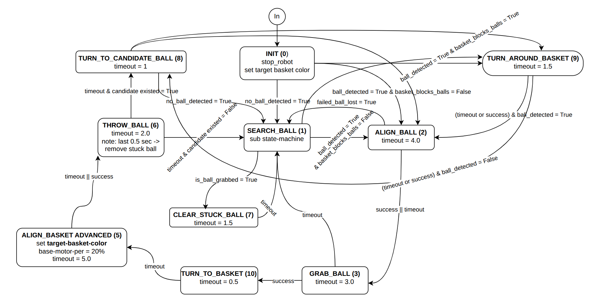
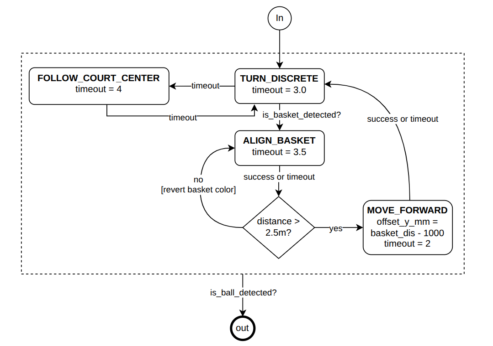

= Game Logic Controller
John <ducman1998@gmail.com>
:toc:
:sectnums:

== Overview
`game_logic_controller_node` is the high-level decision node.
It reads perception/odometry status via `PeripheralManager`, runs a timer loop (`60 Hz`), and selects the next robot behavior state (search, align, grab, throw, recover).

Core components used by the node:

- `PeripheralManager`: unified access to `/odom`, `/image/info`, IR sensor, and command publishing.
- `BaseHandler`: odometry-based base motions (turn/move).
- `ManpulationHandler`: ball/basket alignment, grab, throw, and basket-avoidance actions.

== State Machine Diagram

The implementation follows this diagram with a top-level state machine and one sub-state machine inside `SEARCH_BALL`.

== Main States
=== INIT
- Stops robot and waits until all required inputs are ready (`odom`, `image info`, IR).
- Sets target basket color from referee/dev mode.
- If a ball is visible: go to `ALIGN_BALL` (or `TURN_AROUND_BASKET` if basket blocks the ball).
- If no ball for several frames: go to `SEARCH_BALL`.

=== SEARCH_BALL
- If ball is grabbed: jump to basket alignment (`ALIGN_BASKET_ADVANCED` when enabled, else `ALIGN_BASKET`).
- If a ball appears: go to `ALIGN_BALL` (or `TURN_AROUND_BASKET` if blocked).
- Otherwise run the search sub-state machine (`TURN_DISCRETE -> ALIGN_BASKET -> MOVE_FORWARD`).

=== ALIGN_BALL
- Uses manipulation alignment control to center and approach the closest ball.
- On `SUCCESS` or `TIMEOUT`: go to `GRAB_BALL`.
- On `FAILED_BALL_LOST`: go back to `SEARCH_BALL`.

=== GRAB_BALL
- Drives forward with grab servo action.
- On `SUCCESS`, if target basket is already visible: `ALIGN_BASKET_ADVANCED` (enabled path) or `ALIGN_BASKET`.
- On `SUCCESS`, if target basket is not visible: `PRE_ALIGN_BASKET` using heading estimate to basket.
- On `TIMEOUT`: return to `SEARCH_BALL`.

=== PRE_ALIGN_BASKET
- Continuous turn toward estimated basket direction.
- Transitions to basket alignment when done, timed out, or when target basket becomes visible.

=== ALIGN_BASKET / ALIGN_BASKET_ADVANCED
- `ALIGN_BASKET`: angular alignment to basket direction.
- `ALIGN_BASKET_ADVANCED`: marker-assisted position refinement plus final angle alignment.
- On `SUCCESS` or `TIMEOUT`: go to `THROW_BALL`.
- In advanced mode, if ball is no longer grabbed: return to `SEARCH_BALL`.

=== THROW_BALL
- Runs thrower + servo sequence.
- On `TIMEOUT`, if a candidate ball heading exists: `TURN_TO_CANDIDATE_BALL`.
- On `TIMEOUT`, if no candidate heading exists: `SEARCH_BALL`.
- On basket-lost failure: go back to `ALIGN_BASKET`.

=== TURN_TO_CANDIDATE_BALL
- Turns toward precomputed candidate ball heading.
- On finish/timeout, if a ball is visible: `ALIGN_BALL` (or `TURN_AROUND_BASKET` if blocked).
- On finish/timeout, if no ball is visible: `SEARCH_BALL`.

=== TURN_AROUND_BASKET
- Moves around basket to remove line-of-sight blocking to ball.
- On finish/timeout, if a ball is visible: `ALIGN_BALL`.
- On finish/timeout, if no ball is visible: `TURN_TO_CANDIDATE_BALL` (if heading exists) or `SEARCH_BALL`.

=== CLEAR_STUCK_BALL
- Recovery state to force-clear thrower path.
- On timeout: return to `SEARCH_BALL`.

== SEARCH_BALL Sub-State Machine

Sub-states are used only while main state is `SEARCH_BALL`:

- `TURN_DISCRETE`: discrete yaw scan using `BaseHandler.turn_robot_disc`.
- `ALIGN_BASKET`: face a basket (target or opponent depending on branch).
- `MOVE_FORWARD`: short forward move to change viewpoint when basket is far.

Typical cycle:

1. `TURN_DISCRETE` completes.
2. `ALIGN_BASKET` estimates basket distance.
3. If far (`> 2500 mm`): `MOVE_FORWARD`, then back to `TURN_DISCRETE`.
4. If near: switch align target basket/opponent basket and continue scan.

== Transition Priorities in Loop
Each timer tick (`game_logic_loop`) follows this order:

1. Handle global guards (game inactive in non-dev mode -> stop/reset).
2. Execute logic for current main state.
3. Inside `SEARCH_BALL`, first check immediate events (ball grabbed/detected), then run sub-state step.

This ordering keeps reactions to newly detected balls fast while still maintaining a deterministic scan behavior.

== Referee and Dev Mode Behavior
- In normal mode, game logic runs only after referee `start` signal; on `stop`, robot is stopped and state resets to `INIT`.
- In current code `DEV_MODE = True`, so local testing can run without referee start.

== Key Timeouts and Tunables
Most transitions are guarded by timeout constants in `state_handlers/parameters.py`, for example:

- `MAIN_TIMEOUT_ALIGN_BALL`
- `MAIN_TIMEOUT_GRAB_BALL`
- `MAIN_TIMEOUT_ALIGN_BASKET`
- `MAIN_TIMEOUT_ALIGN_BASKET_ADVANCED_TOTAL`
- `MAIN_TIMEOUT_THROW_BALL`

These values control reactivity vs stability and are the first place to tune match behavior.

== Execution Entry
[source,shell]
----
ros2 run basket_robot_nodes start_game_logic_controller
----

The node logs current state/sub-state, referee status, target basket color, and elapsed state time each cycle.
